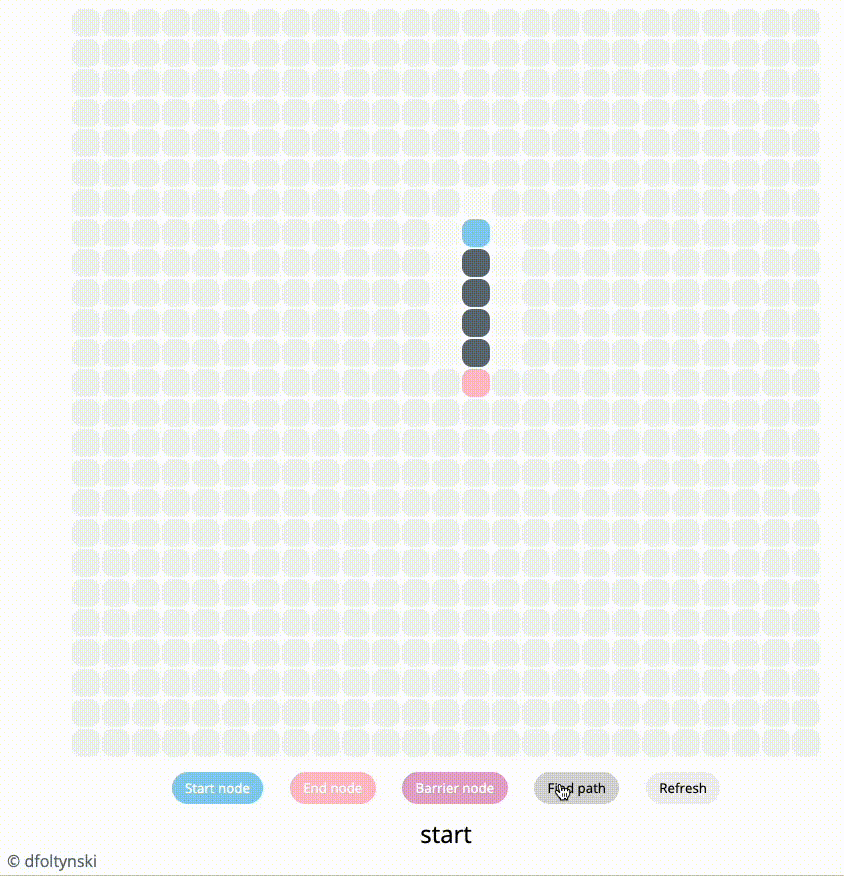

# A\* algorithm visualization made with TypeScript

<a href="https://dfoltynski-astar-typescript.netlify.app/" target="_blank">
<p>LIVE DEMO</p>



</a>

## Usage

### Step 1

run

```sh
    git clone https://github.com/dfoltynski/typescript-astar.git
    cd typescript-astar
    npm run dev
```

and navigate to <a href="http://localhost:8080" target="_blank">localhost:8080</a>

### Step 2

Change whatever you want, improve/screw up my code.
